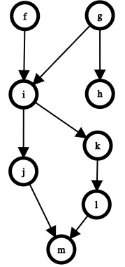

AsyncFlow Documentation
=======================

.. toctree::
   :hidden:
   :maxdepth: 1

   api

.. automodule:: asyncflow
   :noindex:

Installation
------------

Install using pip:

.. code-block:: text

    pip install asyncflow

Introduction
------------

    Figure 1: A DAG can be used to understand the possible execution
    paths a program can take.

It is often rightly said that concurrency is hard. In the concurrent
world, it is difficult to reason about what lines of code
will execute when, since, by design, this is non-determinate. This can lead to
incorrect assumptions and bugs.

AsyncFlow simplifies concurrency by requiring the programmer to write
functions and then tie them together by specifying their
interdependencies. Conceptually this creates a directed acyclic graph
(DAG).

Figure 1 shows an example of such a DAG of eight functions,
labelled ``f`` through ``m``. At the outset, ``f`` and ``g`` can be
executed concurrently since neither have any dependencies. What happens
next depends on which of ``f`` and ``g`` finished first. If ``g``
finishes first then ``h`` can start (concurrently with ``f``), but if
``f`` finished first then we must wait for ``g`` to finish before
running both ``h`` and ``i``.

AsyncFlow continues reasoning in this way to execute all the functions
as efficiently as possible while never executing a function before its
dependencies have finished.

Executing a Flow
~~~~~~~~~~~~~~~~

AsyncFlow calls such a set of functions and their inter-dependencies a
*flow*. The goal of AsyncFlow is to execute flows as efficiently as
possible.

To execute a flow, one of the following asynchronous frameworks is
required:

#. asyncio_;
#. trio_;
#. curio_.

.. _asyncio: https://docs.python.org/3/library/asyncio.html
.. _trio: https://trio.readthedocs.io/en/stable/
.. _curio: https://curio.readthedocs.io/en/latest/

The framework will take care of concurrently executing the functions in
the flow.

.. topic:: ``async def`` or ``def``

    Flows can contain async functions (defined with ``async def``),
    synchronous functions (defined with ``def``) or a mixture of the
    two.

    For async functions, concurrency is achieved by running the
    function using your chosen async framework's event loop.

    Synchronous functions will be run in a thread using the machinery
    provided by your chosen async framework.

    This is all taken care of under the hood, so in most cases you
    don't have to worry about it.

We will see the precise syntax for executing a flow below.

Basic Usage
-----------

A flow should be constructed using the class appropriate to your chosen
async framework:

============   ========
Framework      Class
============   ========
asyncio        :class:`AsyncioFlow`
trio           :class:`TrioFlow`
curio          :class:`CurioFlow`
============   ========

In the following examples we will use :class:`AsyncioFlow`, but since
all flow classes have the same interface, you can swap out
:class:`AsyncioFlow` for another class and the rest of the code will be
unaffected.

To use AsyncFlow, create a flow and then use it as a decorator::

    from asyncflow import AsyncioFlow

    flow = AsyncioFlow()

    @flow()
    async def f():
        """Since the @flow() decorator has no arguments, f is assumed
        not to have any dependencies.
        """

    @flow(upstream=f)
    async def g():
        """Since @flow() was passed the upstream argument with a value
        of f, g will only execute once f has finished.
        """

    @flow(upstream=[f, g])
    async def h():
        """Since @flow was passed the upstream argument with a list
        containing both f and g, h will only execute once both f and g
        have finished.
        """

     @flow()
     def i():
        """AsyncFlow can handle synchronous functions too. These are
        automatically run in a thread to allow for concurrent
        execution.
        """

The ``flow`` object in the above example has an ``execute`` methods,
which is an async function. This can be run in the usual way depending
on which async framework you are using::

    # Asyncio
    import asyncio
    asyncio.run(flow.execute())

    # Trio
    import trio
    trio.run(flow.execute)

    # Curio
    import curio
    curio.run(flow.execute)

Locks
-----

AsyncFlow can require a function to acquire a lock or semaphore prior
to executing. The :class:`Lock` and :class:`Semaphore` classes offered
by AsyncFlow are automatically converted to your chosen async
framework's native lock and semaphore types during execution::

    from asyncflow import AsyncioFlow, Lock, Semaphore

    flow = AsyncioFlow()
    l = Lock()
    s = Semaphore(2)

    @flow(lock=l)
    def f(): ...

    @flow(lock=l)
    def g(): ...

    @flow(lock=s, upstream=[f, g]):
    def h(): ...

    @flow(lock=s, upstream=[f, g])
    def i(): ...

    @flow(lock=s, upstream=[f, g])
    def j(): ...

Here, ``f`` and ``g`` have no dependencies, but since they both need to
acquire lock ``l``, they will not run concurrently.

After ``f`` and ``g`` have finished, ``h``, ``i`` and ``j`` are ready
to run, but a maximum of two of these will run at any one time since
they must acquire ``s``.

Programatic Flow Specification
------------------------------

At times the decorator based API for specifying flows may be
inconvenient. For example, one may wish to create a flow from functions
defined in a third party module.

An alternative API is therefore offered for specifying flows using the
:class:`Series` and :class:`Parallel` classes. A :class:`WithLock`
class is also available to specify that a function should acquire a
lock prior to execution. ::

    from asyncflow import AsyncioFlow, Series, Parallel, WithLock, Lock

    # Import functions from an external source
    from somewhere import f, g, h, i, j, k

    l = Lock()

    flow = AsyncioFlow(
        Series(
            f,
            g,
            Parallel(
                WithLock(h, l),
                WithLock(i, l),
                Series(
                    j,
                    k
            ),
    )

This is equivalent to the following code using the decorator-based API::

    from asyncflow import AsyncioFlow, Lock

    l = Lock()

    @flow()
    def f(): ...

    @flow(upstream=f)
    def g(): ...

    @flow(upstream=g, lock=l)
    def h(): ...

    @flow(upstream=g, lock=l)
    def i(): ...

    @flow(upstream=g)
    def j(): ...

    @flow(upstream=j)
    def k(): ...
